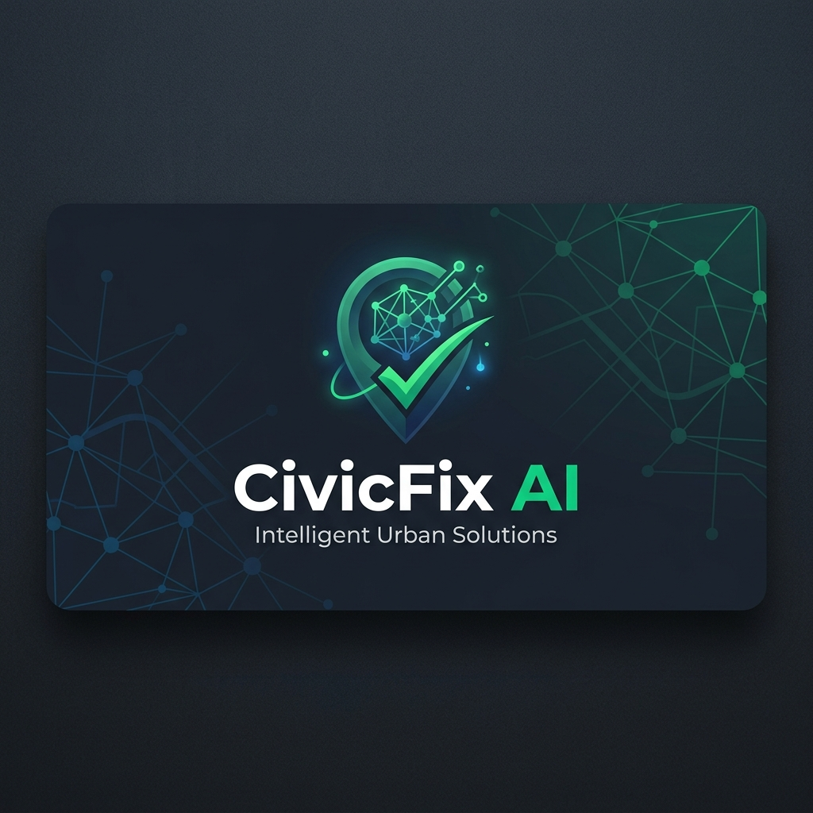
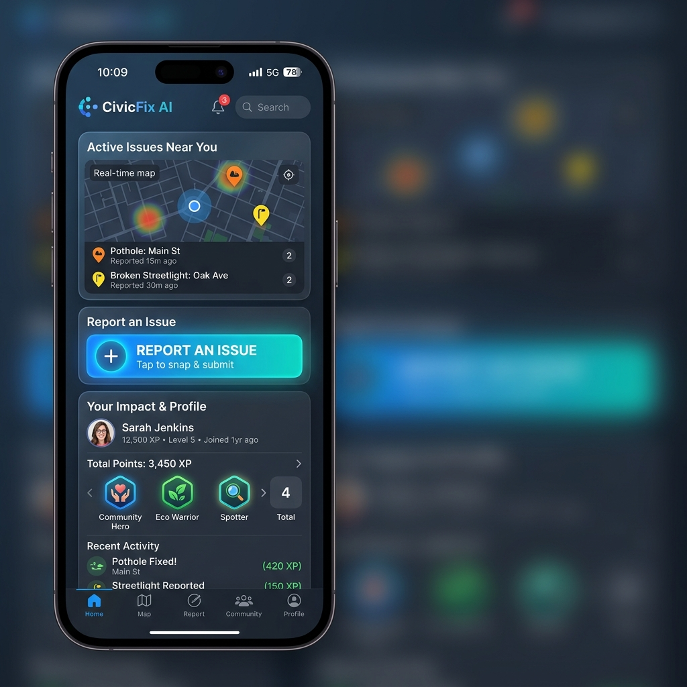
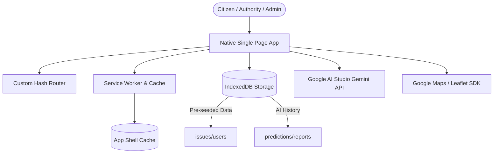
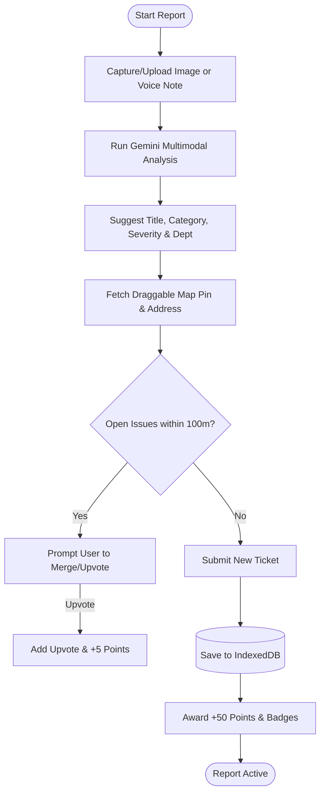
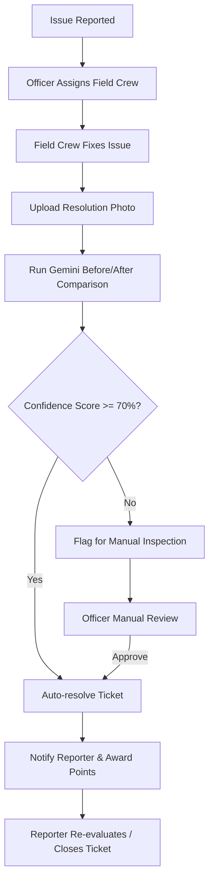

# 📍 CivicFix AI

[](assets/civicfix_logo_banner.png)

**CivicFix AI** is a state-of-the-art Progressive Web App (PWA) built to bridge the gap between citizens and municipal authorities. It enables community-driven civic issue reporting, automated verification, and transparent resolution tracking. 

By leveraging **Google AI Studio (Gemini 1.5 Flash models)** for image classification, voice transcription, and fix validation, alongside a **unified Google Maps/Leaflet Map fallback engine**, CivicFix AI turns reporting potholes, streetlights, garbage, and leaks into a seamless, gamified community effort.

---

## 🌟 Unique Features

### 1. Multimodal AI Copilot (Gemini Integration)
CivicFix AI uses advanced multimodal AI prompts to parse and classify reports automatically:
- **Vision Classification:** Automatically analyzes uploaded media to recommend the issue category (e.g., pothole, streetlight, garbage, flooding), severity level (1 to 5), and the responsible municipal department.
- **Voice Transcription:** Transcribes citizen voice recordings (up to 60 seconds) directly into written descriptions using Google Gemini Audio APIs.
- **Before/After Fix Validation:** When a field crew uploads a picture of a resolved issue, the AI compares the original and the new photo. If the resolution confidence score exceeds 70%, the ticket is automatically resolved.

### 2. Proactive Duplicate Prevention
- To prevent cluttering, the app uses browser geolocation to scan for open reports within a **100-meter radius** that match the same category.
- Citizens are prompted to **upvote and merge** their report into the existing issue instead of creating duplicates, receiving a **+5 upvote point boost** while keeping city databases clean.

### 3. Unified Map & Failover Engine
- Full integration with **Google Maps SDK** for real-time pin dragging and address lookup.
- If Google Maps fails to load (due to API key limits or credential errors), the application automatically falls back to **Leaflet** with CartoDB Voyager tiles.
- **Dynamic Dark Mode Map styling:** Map layers automatically switch to dark mode maps (CartoDB Dark Matter) matching the system settings.

### 4. Interactive Gamification System
- Automatic points triggers: Reporting (+50), Upvotes (+5), Comments (+10), Resolutions (+100), and Weekly Streaks (+200).
- Automatic Badge Awards: *First Reporter*, *Watchdog* (10 reports), *Verified Voice* (3 resolved), *Streak Master*, and *Top Contributor*.
- A public leaderboard showing "This Month" vs "All Time" contributor rankings.

### 5. Role-Based Dashboards
- **Citizen:** View feeds, submit reports with live camera feeds, comment, upvote, track custom stats, and inspect their profile badges.
- **Authority (Officer Rajesh Kumar):** Accesses operational control panels, manages dispatch assignments, reviews AI resolution comparisons, and compiles monthly PDF reports.
- **Admin:** Special dashboard for creating/managing officer accounts, toggling issue categories, and auditing open tickets.

### 6. Offline-First PWA Capabilities
- Serves an interactive `offline.html` page when offline.
- Custom service worker (`sw.js`) caches styling, routing pages, and SVGs to ensure the app loads instantly under any network condition.

---

## 📱 Application Mockup

Here is a preview of the CivicFix AI citizen dashboard showing active reports, leaderboard status, and reporting tools:

[](assets/civicfix_dashboard_mockup.png)

---

## 📊 System Architecture & Workflows

### 1. High-Level Architecture
The diagram below details the interaction between the Frontend Single-Page App (SPA), the service worker cache, IndexedDB for offline data persistence, and external APIs (Google AI Studio and Maps SDK).



---

### 2. Issue Reporting Workflow (with AI Classification)
This flowchart shows the process when a citizen reports a civic issue:



---

### 3. Resolution & Verification Workflow (with Before/After AI comparison)
The municipal officer dispatch and automated validation workflow:



---

## 🛠️ Local Development & Setup

### Prerequisites
- Node.js installed.
- Open [js/config.js](js/config.js) and enter your API keys.

### Run Server
Initialize dependencies and launch the local development server:
```bash
npm install
npm run dev
```

The application will be served at `http://localhost:8080`.

### Pre-seeded Accounts
- **Admin:** `admin@civicfix.gov` / `admin123`
- **Authority:** `officer@civicfix.gov` / `officer123`
- **Citizen:** `citizen@civicfix.gov` / `citizen123`
